# The Axioms of Probability Theory

There are three statements typically taken to be the axioms of probability theory:

1. **[Normalization] The probability of any tautology is 1:** $P(\top) = 1$.
2. **[Non-Negativity] The probability of any proposition is greater than or equal to 0.** That is, for any $A$, $P(A) \geq 0$
3. **[Additivity] The probability of the disjunction of two mutually exclusive propositions is the sum of their probabilities.** That is, for mutually exclusive $A$ and $B$, $P(A \lor B) = P(A) + P(B)$

These axioms stipulate what a function $P$ must satisfy, in order for it to count as a representation of probability. For our purposes, these axioms are foundational truths; if we encounter a function which violates any one of these axioms, then it is not relevant to probability theory.

# Consequences of the Axioms

**(Formula for Contradictions)** Immediately from the axioms, we can show that contradictions are to be assigned probability 0. Here is a quick proof (no need to memorize the proof; the point here is to show that from just three axioms, we can derive many of the other properties which we think that probabilities should do). We start with the fact that the probability of any tautology is 1:
$$
P(\top) = 1
$$
We know that if a tautology is one of the disjuncts of the disjunction, then the disjunction itself is a tautology (that is, if X is always true, then the statement "either X or Y" will also always be true). Therefore, by the axiom of normalization:
$$
P(\top \lor \perp) = 1
$$
We then note that any tautology $\top$ is mutually exclusive with any contradiction $\perp$. Hence, by the axiom of additivity:
$$
P(\top \lor \perp) = P(\top) + P(\perp)
$$
Putting all the pieces together we get:
$$
\begin{align}
1 = 1 + P(\perp) \implies P(\perp) = 0
\end{align}
$$
**(Formula for Negated Propositions)** The next very important consequence of the axioms is a negation rule. It tells us what the probability of the negation of a proposition is, given that we know the probability of the un-negated proposition. That is:
$$
P(\sim A) = 1 - P(A)
$$
The proof for this statement is similar to the one just proved.

**(General Formula for Disjunction)** Another consequence of the axioms is an equation for any disjunction. The additivity axiom gives us an equation for the disjunction of mutually exclusive propositions. This equation tells us what the probability of any disjunction of statements is:
$$
P(A \lor B) = P(A) + P(B) - P(A \& B)
$$
There is an algebraic proof of this which is not too difficult, but which would lengthen this note unnecessarily. In any case, the algebraic proof just follows the intuition which one would get from the pictoral representation of what is going on here. What we want is an equation for the light-blue shaded area, which represents $P(A \lor B)$:

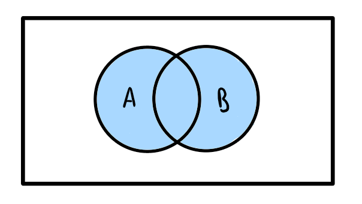{width=350px}

To get started, we add up the area within the A circle (shaded teal blue) which represents $P(A)$ and the area within the B circle (shaded red) which represents $P(B)$. When we do this, we see that we are left with a section which is shaded both neon blue and red, resulting in a dark blue. This dark blue area represents $P(A \& B)$. The dark blue color, means that we "double counted" this area. To fix this, we just subtract out the $A \& B$ area. That is, we subtract out $P(A \& B)$ once.

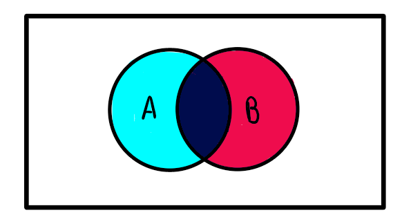{width=350px}

So, we end up with the equation:
$$
\begin{align}
P(A \lor B) &= \text{teal blue} + \text{red} - \text{dark blue}\\
&= P(A) + P(B) - P(A \& B)
\end{align}
$$

# Conditional Probability

When considering conditional probabilities, we are interested in the probability of some proposition $A$ being true given that we know that some other proposition $B$ is true. We use $P(A | B)$ to mean the probability of $A$ conditional on $B$ being true. It is defined to be:

$$
P(A|B) = \frac{P(A\& B)}{P(B)}
$$
This definition turns out to make sense for many reasons. However, for now, let us just treat this as stipulated.

Conditional probability is tied up with the notion of **independence**. Two propositions, $A$ and $B$, are independent just in case $P(A | B) = P(A)$.
With this definition of independence, we can prove two equations for conjunctions of propositions.

**(Formula for Independent Conjuncts)** Given that $A$ and $B$ are independent then by the definition of conditional probabilities, we have:
$$
P(A|B) = \frac{P(A\& B)}{P(B)} \implies P(A) = \frac{P(A\& B)}{P(B)}
$$
Which then implies:
$$
P(A \& B) = P(A) \times P(B)
$$
It is crucial to note here that this is not true for any $A$ and $B$. It is only true for propositions which are independent of one another.

**(Formula for Conjunction)** One general formula for the conjunction of any two propositions can be quickly obtained though. We note from the definition of conditional probabilities that:
$$
P(A | B) = \frac{P(A \& B)}{P(B)}
$$
It then follows that:
$$
P(A \& B ) = P(A | B) \times P(B)
$$

# Example: Two Four-Sided Dice

Suppose we have two fair four-sided die and we roll both of them. Let us first think about how we might represent all the possible outcomes of rolling both die. We could list out all the possibilities. Dice one may result in a 1 and dice two may result in a 1; dice one may result in a 2 and dice two may result in a 1... This can go on for a while. Often, in mathematics, finding a representation of a given situation can be very useful for conceptualizing a problem; however, finding such a representation is also often the hard aspect of a problem. Thankfully, the following representation will work for us:

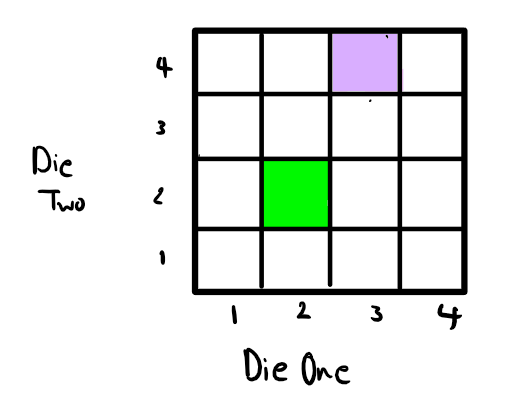{width=350px}

Here, each square represents a possible outcome. For example, the green square represents the outcome where the first die results in 2 and the second die also results in 2. The lavender square represents the outcome where the first die results in 3 and the second die results in 4.

Now since the two dice are fair, that means that all the outcomes are equiprobable (having equal probability). So suppose we want to know what the probability of getting 2 on the first die and 3 on the second die is. We shall represent this as asking, what is the probability of $P(\langle 2,3\rangle)$? Let us first highlight which outcome this is:

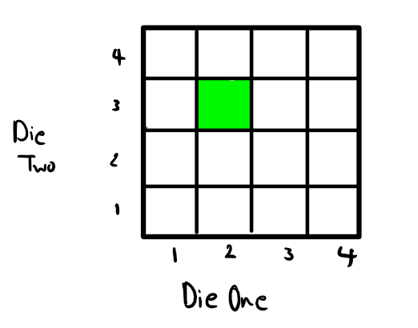{width=350px}

Since each box represents the outcome of rolling both dice and each outcome is equiprobable, we can figure out what the probability of getting $\langle 2,3\rangle$ is by counting how many boxes the event of getting $\langle 2,3\rangle$ takes up and divide that by the total number of boxes. We see that the event $\langle 2,3\rangle$ only takes up 1 box, and there are 16 boxes in total. Therefore:
$$
P(\langle 2,3\rangle) = \frac{1}{16}
$$
Let us think about a more difficult question. What is the probability that the first die results in a 2? Well, let us look at all the outcomes in which the first die does result in 2.

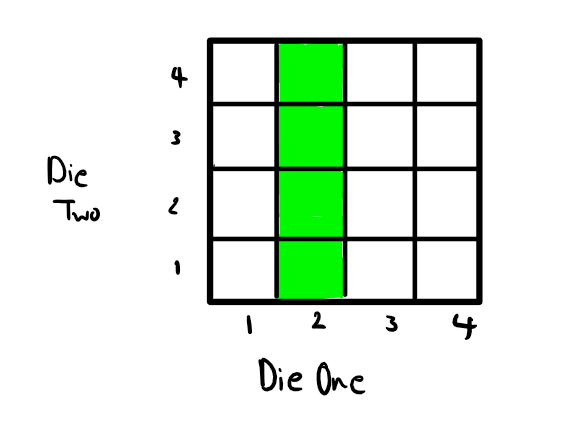{width=350px}

Here we see that the event "dice one results in 2" takes up 4 boxes. Again, since each outcome is equiprobable, we find the probability of dice one resulting in 2 by counting the number of boxes which it takes up and divide by the total number of boxes. In this case, we get:
$$
P(\text{D1 = 2}) = \frac{4}{16} = \frac{1}{4}
$$
Finally, let us consider the situation in which we are interested in the sum of the results of the two dice. For instance, we might want to know, what is the probability that the two dice results have a sum of 6. Again, let us find the outcomes in which the results have a sum of 6:

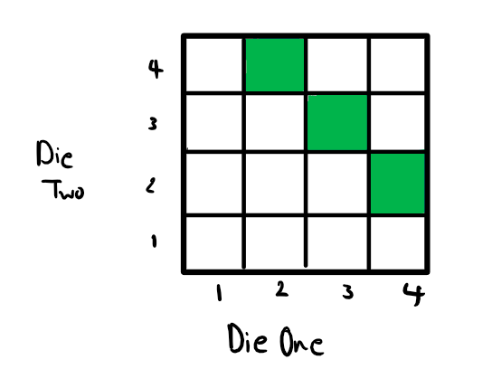{width=350px}

We see that the event of the two dice having a sum of 6 takes up only 3 boxes. Therefore, due to the same reasoning as before, we have:
$$
P(\text{sum of dice }=6) = \frac{3}{16}
$$

# Example: A Small Deck of Cards

Consider a "deck" of cards consisting of only eight cards:

{width=350px}

Here, we have two "d" cards, two "h" cards, two "c" cards and two "s" cards. Let us suppose that when we draw from this deck that we have an equal chance of drawing any one of the cards. Hence, for example, since there are eight cards in total, the probability of drawing a "c" card is:
$$
P(c) = \frac{2}{8} = \frac{1}{4} 
$$
Because there are 2 "c" cards and 8 cards in total.

Now, what is the probability of drawing a "d" card on the first draw, putting that card back into the deck (i.e., with replacement), and then drawing an "s" card? We can represent the possible outcomes of two draws as follows:

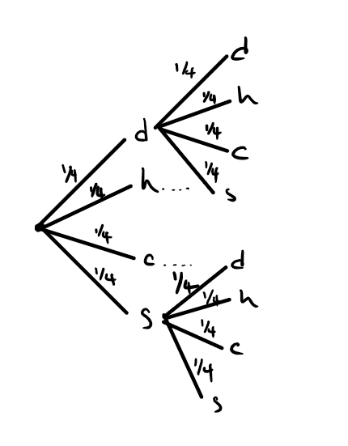{width=350px}

Here we have a "tree" representation of the possible outcomes. I haven't drawn the middle "branches" for the "h" and "c" scenarios as it gets too crowded. Just know that there should be four branches extending from those letters as well. I have also made use of the fact that we do not really care, in this particular question, about which "d" or "c" or "h" or "s" card we pick. Hence the probability of picking a card of any type ("d", "c", "h", or "s") is $1/4$. Starting from the left hand side, we see that for our first draw we have four possibilities. We have a $1/4$ chance of drawing a "d", a $1/4$ chance of drawing an "h", and so on. Suppose that on our first draw we get an "s". Then we are here on the tree:

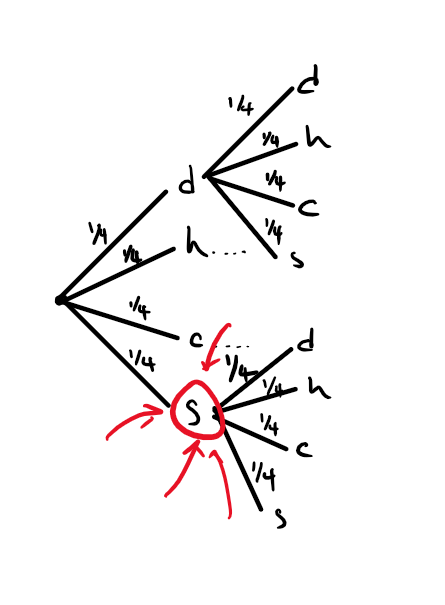{width=350px}

From there, there are four possibilities for our second draw each having probability of $1/4$. Now, if we want to know the probability of getting a "c" putting it back and then getting an "h", what we should do is look at the probability of ending up here:

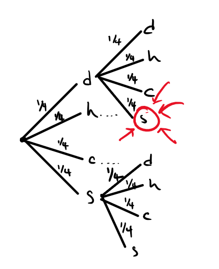{width=350px}

To calculate this, we look at the probability of $P(s_2 \& d_1)$. Here I have subscripted the letters (subscripting means putting little numbers next to the letters) in order to indicate which draw it is. For instance, $s_2$ means getting an $s$ on the second draw. If we were interested in higher numbers of draws, we may write say $c_5$ for getting a $c$ on the fifth draw. In this case, $s_2 \& d_1$ corresponds to the single branch:

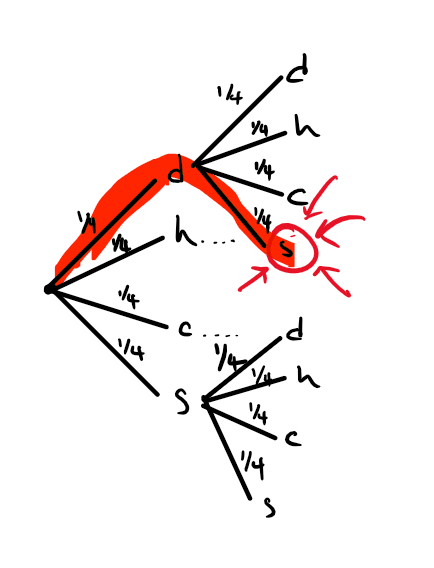{width=350px}

Since each branch is equiprobable (everything has the same number $1/4$ written over it), we can simply count how many branches there are in total. If you count them all (including the ones I have not drawn for "h" and "c"), there are 16 total branches. Therefore, $P(s_2 \& d_1) = 1/16$. [Note that if you use the equation for conjunctions (that is, $P(A\&B) = P(A|B)P(B)$, you will get the same answer; here I use intuition and the power of a good representation to just answer the question directly)]. 

Now what about the situation in which we first draw a "d" and then draw an "s" but we do not put the "d" back into the deck (i.e., without replacement). Here, we need to change our representation. Note that I only draw the top of the tree here with the "d" branch:

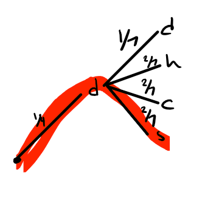{width=350px}

The crucial change is that having first drawn the "d" card, since we do not replace it in the deck, there are now only 7 cards in total. So the probabilities change. Now, we still want to know what $P(s_2 \& d_1)$ is. Here, we need to use the equation:
$$
P(s_2 \& d_1) = P(s_2|d_1)P(d_1)
$$
where $P(s_2|d_1) = 2/7$ (how do we know this? look at the tree! It tells us that given that $d_1$ has already occurred, the probability of getting to $s_2$ is $2/7$. This is why the tree representation is so useful) and $P(d_1) = 1/4$. Therefore:
$$
P(s_2 \& d_1) = \frac{2}{7}\times \frac{1}{4} = \frac{2}{28} = \frac{1}{14}
$$

# Practice Problems

1. Consider one four sided die and one six sided die. We roll both of them at once. What is:
- The probability that the four sided die results in a 3 and the six sided die results in a 6?
- The probability that the sum of the two dice results is 4?
- The probability of the four sided die being 3 or being 2?
- The probability of the six sided die having an even result?

2. Consider a deck with eight cards just like in the example above. However, in this example, there is 1 "d" card, 2 "h" cards, 3 "c" cards, and 2 "s" cards. Each card is drawn at random (i.e., individually, each card has an equal chance of being drawn). What is:
- The probability of an "h" card being drawn in one card draw?
- The probability of an "h" card first being drawn, put back in the deck (i.e., with replacement), and then drawing a "d" card?
- The probability of a "c" card being first being drawn, *not* put back in the deck (i.e., without replacement), and then drawing an "s" card?

