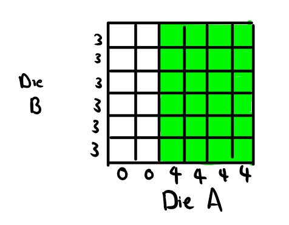
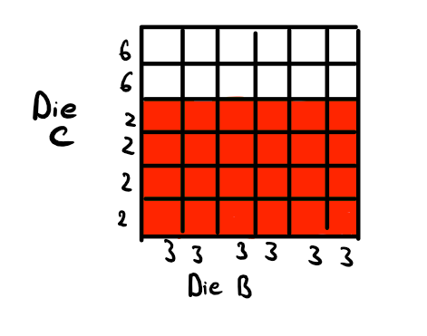

Now that we have the basic probability theory tools we can start playing around with them. In lecture you will have been thinking about the Monty Hall Problem and other examples. We will start off this discussion by looking at another phenomenon, known as intransitive dice. We will then review Bayes Theorem very quickly, before moving onto another strange phenomenon, known as Simpson's Paradox.

# Intransitive Dice and Where to Find Them

 The example I lay out here is from Bradley Efron (unfortunately, I do not know the citation, but a Google search should tell you all you need to know)

Suppose that we have four (fair) dice with the following faces
$$
\begin{align}
  & A = (0,0,4,4,4,4) & B = (3,3,3,3,3,3)\\
  & C = (2,2,2,2,6,6) & D = (1,1,1,5,5,5)
\end{align}
$$
That is, die A has two faces with nothing on them and four faces with four dots on them. Die D has three faces with one dot on them and three faces with five dots on them. Similarly for the other two.

Let us consider two individuals, Willard and Rudolf, who pick different dice. That is, Willard picks die A then Rudolf cannot pick die A. We also suppose that they both pick their dice at the same time.

Suppose Rudolf picks die A and Willard picks B. They both roll their dice at the same time. The winner is the individual with the higher result. What is the probability that the result of die A is greater than the result of die B? That is, what is the value of 
$P(A > B)$? Well, consider the following diagram which lays out the situation:

{width=350px}

The shaded green area is the area in which Die A beats Die B. We can see from the picture alone that Die A will beat Die B $2/3$ of the time. Therefore:
$$
P(A > B) = \frac{2}{3}
$$
Now what if Rudolf picks die B and Willard picks die C? What is the probability that die $B$ beats die $C$, $P(B> C)$? Well we have the following picture:

{width=350px}

Here, the shaded red area indicates when Die B beats Die C. We see again that:
$$
P(B > C) = \frac{2}{3}
$$
We can repeat this procedure to show that:
$$
\begin{align}
&P(C > B) = \frac{2}{3}\\
&P(D > C) = \frac{2}{3}\\
&P(A > D) = \frac{2}{3}
\end{align}
$$
Let us say that die $X$ *dominates* die $Y$ if $X$ beats $Y$ more than half the time (i.e., $P(X > Y) > 1/2$). Then we have that $A$ dominates $B$, which dominates $C$, which itself dominates $D$, which dominates $A$!

What does this mean? Suppose that Rudolf gets to always pick his die after he sees what Willard picks. This means that Rudolf can always pick a die which dominates whatever die Willard picks and hence Rudolf, on average, will win $2/3$ of the time.

# Conditional Probabilities are Probabilities!

It is important to recognize that all the rules that we have for unconditionalized probabilities still apply to conditional probabilities. What does this mean? Take for example, the rule for negated propositions

$$
P(\sim A) = 1 - P(A)
$$

The following is then true:

$$
P(\sim A|B) = 1 - P(A|B)
$$

We just have to make sure that we hold the proposition which we are conditioning upon (in this case $B$) constant. 

Another example: consider the additivity rule (also called the special disjunction rule) for mutually exclusive propositions $A$ and $B$

$$
P(A \lor B) = P(A) + P(B)
$$
Now, suppose we conditionalize upon $C$. Then we get:

$$
P(A\lor B|C) = P(A|C) + P(B|C)
$$
It should be easy to see how this will apply to the other rules. Here are two other examples:

- General Disjunction Rule: $P(A \lor B) = P(A) + P(B) - P(A\&B)$ and so the conditional version is $P(A\lor B|C) = P(A|C) +P(B|C) - P(A\&B|C)$.
- Special Conjunction Rule: Given independent propositions $A$ and $B$, we have $P(A\&B) = P(A) \times P(B)$. So the conditional version is $P(A\&B|C) = P(A|C) \times P(B|C)$
- General Conjunction Rule: $P(A\& B) = P(A|B)P(B)$ and so the conditional version is $P(A \& B | C) = P(A| B\& C)P(B|C)$.

The last one concerning the general conjunction rule is the most complicated one. I will not prove it, so we will just take it as true. I mention this now because we will soon use it.

# Bayes Theorem

The following equation is known as Bayes Theorem:

$$
P(H|E) = \frac{P(E|H)P(H)}{P(E)}
$$

It is fairly easy to prove this. Remember the general conjunction rule tells us that:

$$
P(H \& E) = P(E|H)P(H)
$$
And we have from the definition of conditional probabilities that:

$$
P(H|E) = \frac{P(H \& E)}{P(E)}
$$
So we just substitute in $P(E|H)P(H)$ for $P(H\&E)$ in the numerator and we get Bayes Theorem!

To get the second version of Bayes Theorem, we just need to recognize that the proposition $E$ is logically equivalent to $(E \& H) \lor (E \& \sim H)$ where $(E\& H)$ is mutually exclusive from $(E \& \sim H)$. Therefore:

$$
P(E) = P((E\& H) \lor (E \& \sim H)) = P(E \& H) + P(E \& \sim H) = P(E|H)P(H) + P(E|\sim H)P(\sim H)
$$
And so substituting what we have above for $P(E)$, we find that:

$$
P(H|E) = \frac{P(E|H)P(H)}{P(E|H)P(H) + P(E|\sim H)P(\sim H)}
$$
# Simpson's Paradox

The following example is taken from Joseph B. Kadane's *Principles of Uncertainty* (2nd Ed.). Suppose we have two routes to the summit of a mountain. One is the difficult route $D$ and the other one is the easy route $\sim D$. There are also two kinds of climbers: the amateur climbers $A$ and the expert climbers $\sim A$. Suppose that the probability of an individual reaching the summit *depends* upon whether or not they picked the difficult route or not and upon whether or not they are an amateur or not. The following probabilities are given:
$$
\begin{align}
    &P(R|\sim D \& \sim A) = 0.8 &P(R| \sim D \& A) = 0.7\\
    &P(R|D \& \sim A) = 0.4      &P(R|D \& A) = 0.3
\end{align}
$$
where $R$ is the proposition that the summit has been reached. We also suppose that expert climbers are more likely to take the difficult route:
$$
\begin{align}
&P(D|\sim A) = 0.75 &P(D|A) = 0.35
\end{align}
$$
We want to know which kind of climber reaches the summit more often. Intuition should suggest that the experts reach the summit more often. However, this is not borne out by the math.

What we want to know is whether or not $P(R|\sim A)$ (the probability of reaching the summit given that one is an expert) is greater than $P(R|A)$ (the probability of reaching the summit given that one is an amateur). The first thing to note is that $R = (R \& \sim D) \lor (R\& D)$. That is, reaching the summit is logically equivalent to reaching the summit and not taking the difficult route or reaching the summit and taking the difficult route. Hence, by the rule for logical equivalence:

$$
P(R|\sim A) = P(\:[(R \& \sim D) \lor (R \& D)]\:|\sim A) 
$$

We then also note that $(R \& \sim D)$ and $(R \& D)$ are mutually exclusive. So by the special disjunction rule:
$$
P(\:[(R \& \sim D) \lor (R \& D)]\:|\sim A) = P(R \& \sim D| \sim A) + P(R \& D | \sim A)
$$
Now we can use the general conjunction rule (conditional version) to recognize that:
$$
\begin{align}
&P(R \& \sim D| \sim A) = P(R | \sim D \& \sim A) P(\sim D | \sim A)\\
&P(R \& D | \sim A) = P(R | D \& \sim A) P(D|\sim A)
\end{align}
$$
Therefore:
$$
 P(R \& \sim D| \sim A) + P(R \& D | \sim A) = P(R | \sim D \& \sim A) P(\sim D | \sim A) + P(R | D \& \sim A) P(D|\sim A)
$$
Conveniently, we now have numbers for all of these. So plugging in the numbers, we get:
$$
P(R|\sim A) = (0.8)(0.25) + (0.4)(0.75) = 0.5
$$

Now we want to calculate $P(R| A)$. The procedure is exactly as before and the answer that one should get is:
$$
P(R | A) = 0.56
$$
So in the end, the amateurs are more likely to reach the summit than the experts! The explanation in this particular case is intuitive: the experts are more likely to take the difficult route and that is why they are failing to reach the summit.

Why is this so important? Consider the following. Suppose that we ourselves were at the summit and we know how many of the climbers departed from the base and we only counted whether or not amateurs or experts made it to the top. *We do not ask whether or not they took the difficult or easier route*. This means that, in the long run, we will see $56\%$ of the amateurs make it to the summit and only $50\%$ of the experts make it to the top. We would make the faulty conclusion that the amateurs were better climbers! Taking into account which routes they took explains this number.

To put it in a more serious context, imagine that you are a drug researcher testing a drug. Suppose that you are comparing your drug's capacity to cure some disease X to another drug which is already on the market. You have two labs with which you work. Those in lab A take your drug and those in lab B take the drug that is already on the market. You find that your drug cures disease X more often than the drug already on the market. Hooray! The  pharmaceutical company you work for gives you a pat on the back and releases the drug into the world.

One year later, it is shown that a segment of the population is getting worse from disease X even though they are taking your drug. It turns out that this segment of the population has a genetic mutation which makes your drug toxic to them. While they do not display terrible symptoms (that's why during your clinical trial, nobody detected your drug as problematic), the drug causes their condition to worsen. Furthermore, it turns out that lab A was in a region where this genetic mutation was relatively rare; lab B was in a region where this genetic mutation is common, but remember, the participants at lab B did not take your drug!

In this case, whether or not someone has the genetic mutation is analogous to whether or not someone took the difficult or the easy route. Whether or not someone gets cured of disease X or not is analogous to reaching the top of the summit. And whether or not in the clinical trial, a participant gets your drug or the drug that is already on the market is analogous to whether or not the climber was an expert or an amateur. Because you did not make the distinction between those without the genetic mutation and those with the genetic mutation, you failed to recognize that amongst a sub-population, your drug was actually doing more harm than good.

# Practice Problems

1. Come up with three dice $A$, $B$, $C$ such that $A$ dominates $B$, $B$ dominates $C$, and $C$ dominates $A$.
2. Let $A$, $B$, and $C$ form a partition (see the definition in week 2 notes if you do not remember what a partition is). Suppose that:
$$
\begin{align}
  &P(A) = \frac{1}{10}\\
  &P(B) = \frac{2}{10}\\
  &P(C) = \frac{3}{10}\\
  &P(D) = \frac{4}{10}
\end{align}
$$
And suppose $Z$ is an event such that:
$$
\begin{align}
&P(A\&Z) = \frac{1}{20}\\
&P(B\&Z) = \frac{3}{20}\\
&P(C\&Z) = \frac{5}{20}\\
&P(D\&Z) = \frac{7}{20}
\end{align}
$$
What is $P(A|Z)$, $P(B|Z)$, $P(C|Z)$ and $P(D|Z)$
3. In the section on Simpson's Paradox, the solution to $P(R|A)$ is just given. Walk through the steps of how you would find the numerical value of $P(R|A)$ and check that you get the same answer as the one stated in these notes.
