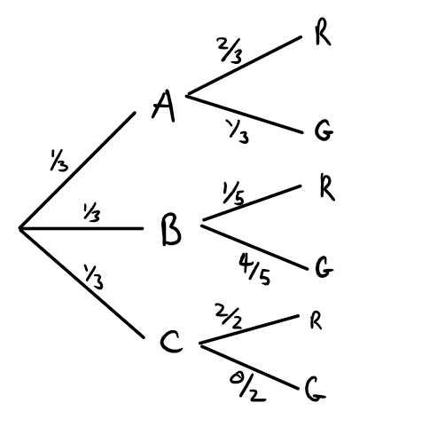

# Theorem of Total Probability

Given a partition $\{B_1,B_2,\ldots,B_n\}$ of $n$ propositions, the following equation is true:

$$
P(A) = P(A|B_1)P(B_1) + P(A|B_2)P(B_2) + \cdots + P(A|B_n)P(B_n)
$$
or equivalently, using sigma notation:

$$
P(A) = \sum_{i = 1}^{n} P(A|B_i) P(B_i)
$$
The $\Sigma$ symbol tells us to sum from $i$ to $n$. In this case, $i = 1$ so it tell us to start with replacing the $i$s with $1$s, then replacing the $i$s with $2$s, then $3$s, until we get to $n$. We then sum up all those terms:

$$
P(A) = P(A|B_1)P(B_1) + P(A|B_2)P(B_2) + \cdots + P(A|B_n)P(B_n)
$$

One very useful case of the Theorem of Total Probability is when the partition that we are considering is of the form $\{B, \sim B\}$. (Make sure you understand why this is a partition). In this case, we get:

$$
P(A) = P(A|B)P(B) + P(A|\sim B)P(\sim B)
$$
# Bayes Theorem - General

Recall Bayes Theorem:

$$
P(H|E) = \frac{P(E|H)P(H)}{P(E)}
$$
We can use the theorem of total probability on $P(E)$ to get:

$$
P(H|E) = \frac{P(E|H)P(H)}{\sum_{i = 1}^{n} P(E|H_i)P(H_i)}
$$
And this is the most general version of Bayes Theorem.

# An Example Using Total Probability

Here we are only considering honey bees and bumblebees. Suppose there are *only* three kinds of personalities which bees may possess: they may be funny bees, jazzy bees or lame bees. Every bee has *at most one* of these personalities (e.g., a funny bee cannot be a jazzy bee nor can it be a lame bee). $10\%$ of all bees are funny, $70\%$ of all bees are jazzy and the remaining $20\%$ are lame. We also know that $20\%$ of the funny bees are bumblebees; $60 \%$ of the jazzy bees are bumble bees; and $30\%$ of the lame bees are bumblebees. What is the probability that a randomly chosen bee is a bumble bee?

Let us use:

- $B$ = Chosen bee is a bumble bee
- $F$ = Chosen bee is a funny bee
- $J$ = Chosen bee is a jazzy bee
- $L$ = Chosen bee is a lame bee

Then note that $F, J $ and $L$ form a partition on the types of bees. This is hinted at when I write there are ***only*** three personalities which bees may possess; there are no other personalities which a bee can be. Hence, by the Theorem of Total Probability:

$$
P(B) = P(B|F)P(F) + P(B|J)P(J) + P(B|L)P(L)
$$
We are told that of all the bees, only $10\%$ are funny and that of the funny bees, $20\%$ are bumblebees. Therefore:
$$
P(B|F)P(F) = (0.1)(0.2)
$$
We are also told that of all the bees, only $70\%$ are jazzy and that of the jazzy bees, $60\%$ are bumblebees. Therefore:
$$
P(B|J)P(J) = (0.6)(0.7)
$$
Finally, we are told that the remaining $20\%$ of bees are lame and that of the lame ones, $30\%$ are bumblebees. Therefore:

$$
P(B|L)P(L) = (0.3)(0.2)
$$
I leave it to you to fill in the numbers for the equation for $P(B)$ and solve it.

# Boxes and Colored Balls

There are three boxes, box A, box B and box C, which are indistinguishable from our point of view. Hence, the probability that we pick any one particular box is equivalent to the probability that we pick any other particular box (i.e., $P(A) = P(B) = P(C) = 1/3$). Box A has 2 red balls and 1 green ball. Box B has 1 red ball and 4 green balls. Box C has 2 red balls.

Here is one way to visualize this scenario:

{width=350px}

Make sure that you understand how this diagram represents the scenario described.

(i) Suppose that we pick a box at random and we draw a green ball. What is the probability that we picked box $A$?

What is the probability that this question is asking for? It is:

$$
P(A|G)
$$
That is, we want to know the probability that we have box $A$ given that we picked a green ball. There are three versions of Bayes Theorem which we can use. Let's try the first one:

$$
P(A|G) = \frac{P(G|A)P(A)}{P(G)}
$$

Well, we can figure out the value of $P(G|A)$ and $P(A)$. We know that the probability of getting box $A$ just is $P(A) = 1/3$. We know that since there is one green ball in box $A$ and three balls in box $A$ in total, that $P(G|A) = 1/3$. But what is $P(G)$, the probability that we get a green ball in general? We do not know, so it turns out we will have to use the general version of Bayes Theorem. This is going to require us to use the Theorem of Total Probability which itself requires us to identify a partition class. The appropriate partition class to be using here is $\{A,B,C\}$ (make sure you understand why this is a partition). Hence, Bayes Theorem (general)

$$
P(A|G) = \frac{P(G|A)P(A)}{P(G|A)P(A) + P(G|B)P(B) + P(G|C)P(C)}
$$
We know that there are $0$ green balls in box $C$. Hence, $P(G|C) = 0$. Therefore, we can ignore the $P(G|C)P(C)$ term. We know that there are $4$ green balls out of the $5$ balls in box $B$. Therefore, $P(G|B) = 4/5$. We also have that $P(B) = 1/3$. Therefore:
$$
P(A|G) = \frac{\frac{1}{3} \times \frac{1}{3}}{\left(\frac{1}{3} \times \frac{1}{3}\right) + \left(\frac{4}{5} \times \frac{1}{3}\right)}
$$

(ii) Suppose that we draw a green ball and do not return it to the box we picked it from. We draw from that very same box a red ball. Now, what is the probability that we picked from box $A$?

Here we want to know:
$$
P(A| G_1 \& R_2)
$$
I use the subscripts here to mark whether or not it was the first ball picked or the second ball picked. That is, $G_1$ is the proposition that the first ball picked was green and $R_2$ is the propositions that the second ball picked was red.

We use Bayes Theorem again:
$$
P(A|G_1 \& R_2) = \frac{P(G_1 \& R_2 |A) P(A)}{P(G_1 \& R_2)}
$$
We can first apply the conditional version of the general conjunction rule (we cannot use the special rule since $G_1$ and $R_2$ are not independent of each other) to get [look at last week's notes for a remined on the conditional version of the general conjunction rule]:
$$
P(A|G_1 \& R_2) = \frac{P(R_2|G_1 \& A)P(G_1|A)P(A)}{P(G_1 \& R_2)}
$$
Just as in (i), we do not actually know the value of $P(G_1 \& R_2)$. What we needed instead was the general version of Bayes Theorem. We use the same partition as in (i). The numerator remains the same and so we can write it as:
$$
P(A|G_1 \& R_2) = \frac{P(R_2|G_1 \& A)P(G_1|A)P(A)}{P(R_2| G_1 \& A)P(G_1|A)P(A) + P(R_2| G_1 \& B)P(G_1\& B)P(B) + P(R_2|G_1 \& C)P(G_1|C)P(C)}
$$
Again, since there are no green balls in box $C$, we have that $P(G_1|C) = 0$ hence we can rewrite the preceding equation as:
$$
P(A|G_1 \& R_2) = \frac{P(R_2|G_1 \& A)P(G_1|A)P(A)}{P(R_2| G_1 \& A)P(G_1|A)P(A) + P(R_2| G_1 \& B)P(G_1\& B)P(B)}
$$
I will leave it to you to figure out how I got the following numbers:
$$
P(A|G_1 \& R_2) = \frac{1\times \frac{1}{3}\times \frac{1}{3}}{\left( 1\times \frac{1}{3} \times \frac{1}{3}\right) + \left( \frac{1}{4} \times \frac{4}{5} \times \frac{1}{3} \right)}
$$

# Medical Testing

This problem is from Joseph B. Kadane's *Principles of Uncertainty*: Phenylketonuria (PKU) is a genetic disorder that affects infants and can lead to mental disability unless treated. It affects about 1 in 10 thousand newborn infants. Suppose that the test has a sensitivity of $99.99\%$ (sensitivity is the probability that an individual tests positive given that they have PKU) and a specificity of $99\%$ (specificity is the probability that an individual tests negative given that they do not have PKU). 

(i) What is the probability that a baby has PKU if the test is positive?

With a question like this, it is always good to first write down which probabilities you do have. We are first told that PKU affects 1 in 10 thousand infants. Hence:
$$
P(PKU) = \frac{1}{10000}
$$
We are then told the sensitivity:
$$
P(Positive|PKU) = \frac{9999}{10000}
$$
and the specificity
$$
P(\sim Positive | \sim PKU) = \frac{99}{100}
$$
And what we want to know is $P(PKU|Positive)$. Well, we know what $P(Positive|PKU)$ is and what $P(PKU)$ is. These are terms we will need to know to solve Bayes Theorem, and so this is a hint that Bayes Theorem is the appropriate tool to use (as opposed to say, using the definition of the conditional probability). Hence:
$$
P(PKU|Positive) = \frac{P(Positive|PKU)P(PKU)}{P(Positive)}
$$
Unfortunately, we do not know $P(Positive)$. So let's try the other version of Bayes Theorem:
$$
P(PKU|Positive) = \frac{P(Positive|PKU)P(PKU)}{P(Positive|PKU)P(PKU) + P(Positive|\sim PKU)P(\sim PKU)}
$$
The new terms we need to figure out are $P(Positive|\sim PKU)$ and $P(\sim PKU)$. Well we know what $P(\sim Positive |\sim PKU)$ is. So we can use the conditional version of the negation rule to get:
$$
P(Positive |\sim PKU) = 1 - P(\sim Positive |\sim PKU) = 1 - \frac{99}{100} = \frac{1}{100}
$$
and we can just apply the negation rule to get:
$$
P(\sim PKU) = 1 - P(PKU) = 1 - \frac{1}{10000} = \frac{9999}{10000}
$$
Therefore, putting all the numbers together, we get:
$$
P(PKU|Positive) = \frac{\frac{9999}{10000} \times \frac{1}{10000}}{\left(\frac{9999}{10000} \times \frac{1}{10000}\right) + \left( \frac{1}{100} \times \frac{9999}{10000}\right)}
$$
(ii) What is the probability that a baby does not have PKU if the test is negative?

Here we want to know what $P(\sim PKU|\sim Positive)$. We follow exactly the same procedure as for (i) to get:

$$
P(\sim PKU|\sim Positive) = \frac{P(\sim Positive|\sim PKU)P(\sim PKU)}{P(\sim Positive|\sim PKU)P(\sim PKU) + P(\sim Positive|PKU)P(PKU)}
$$
I leave it to you to fill in the numbers.

# Coins and Bayes Theorem

Consider three hypotheses which we might hold about a coin:

1. $F$ = the coin is fair
2. $B$ = the coin is biased to come up heads $80\%$ of the time.
3. $C$ = neither $F$ nor $B$ are correct.

Let $E$ be the proposition that the coin has come up 5 times in 5 tosses.

(i) Suppose, initially we believe that the coin is twice as likely to be fair as biased. What is the ratio of posterior probability $P(F|E)/P(B|E)$?

What does it mean to believe that the coin is twice as likely to be fair as biased? Well it means the following:

$$
P(F) = 2 \times P(B)
$$
What we want to calculate is the following ratio:

$$
\frac{P(F|E)}{P(B|E)}
$$
Well, we can use Bayes Theorem to find the numerator and the denominator:

$$
P(F|E) = \frac{P(E|F)P(F)}{P(E|F)P(F) + P(E|B)P(B) + P(E|C)P(C)}
$$
$$
P(B|E) = \frac{P(E|B)P(B)}{P(E|B)P(E) + P(E|F)P(F) + P(E|C)P(C)}
$$
we note that the denominators of both of these two fractions are the same. Hence, when we divide these two fractions with each other, their denominators get cancelled out leaving us with:

$$
\frac{P(F|E)}{P(B|E)} = \frac{P(E|F)P(F)}{P(E|B)P(B)}
$$
Now recall our assumption that $P(F) = 2P(B)$. Substituting that fact in, we get:

$$
\frac{P(F|E)}{P(B|E)} = \frac{P(E|F)2P(B)}{P(E|B)P(B)} = \frac{2P(E|F)}{P(E|B)}

$$
This turns out to be a problem where all the prior probabilities (i.e., $P(F)$, $P(B)$ and $P(C)$) get cancelled out. That is, we do not need to have priors to solve this problem. In any case, now we should calculate $P(E|F)$ and $P(E|B)$. Well, $P(E|B)$ is the probability that we get $5$ heads in $5$ coin tosses. Each toss is independent from every other toss (unless stated explicitly you can use your intuition for these kinds of things). This means that we can use the special conjunction rule. Hence:

$$
P(E|F) = P(Heads) \times P(Heads) \times P(Heads) \times P(Heads) \times P(Heads) = \left(\frac{1}{2}\right)^5
$$
We use the same reasoning to get $P(E|B)$ except here, we have probability $4/5$ (i.e., $80\%$) of getting heads. Hence:

$$
P(E|B) = \left(\frac{4}{5}\right)^5
$$
Therefore:

$$
\frac{P(F|E)}{P(B|E)} = \frac{2P(E|F)}{P(E|B)} = \frac{2 \times \left(\frac{1}{2}\right)^5}{\left(\frac{4}{5}\right)^5}
$$

(ii) Suppose $P(E) = 0.1$, while $P(F) = 0.5$ and $P(B) = 0.2$. What is the posterior probability of $C$ given $E$?

We now want to find $P(C|E)$. Use Bayes Theorem:

$$
P(C|E) = \frac{P(E|C)P(C)}{P(E|C)P(C) + P(E|B)P(B) + P(E|F)P(F)}
$$
Here we have to deal with the nasty conditional probability $P(E|C)$. This is asking for the probability that we get $5$ heads in $5$ tosses given that the coin is not fair nor is it biased to be heads $80\%$ of the time. When is the coin not fair nor biased to heads $80\%$ of the time? It can be when the coin is biased to heads $79\%$ of the time, when the coin is biased to heads $79.1\%$ of the tie, when coin is biased to tails $60\%$ of the time and so on. There are in fact, infinitely many ways the coin could be biased in different ways and not be fair and not be biased towards heads $80\%$ of the time. So what do we do?

Here's one way to solve it. We know from the Theorem of Total Probability that (think about why $\{B,F,C\}$ for a partition):

$$
P(E) = P(E|B)P(B) + P(E|F)P(F) + P(E|C)P(C)
$$
Let us isolate the $P(E|C)$ term:

$$
P(E|C) = \frac{P(E|B)P(B) + P(E|F)P(F)}{P(C)}
$$
Well now we need $P(C)$. Thankfully, getting this value is not hard. Recognize that $F, B$ and $C$ form a partition. If $F$ is true then $B$ and $C$ cannot be true. If $B$ is true then $F$ and $C$ cannot be true. If $C$ is true then $F$ and $B$ cannot be true. And the three propositions are exhaustive. Hence:
$$
P(C) = 1 - [P(F) + P(B)] = 1 - 0.7 = 0.3
$$
So we can solve for $P(E|C)$:

$$
P(E|C) = \frac{\left(\frac{4}{5}\right)^5 \times \frac{1}{5} + \left(\frac{1}{2}\right)^5 \times \frac{1}{2}}{\frac{3}{10}}
$$
You can calculate whatever value that is and then go back to the equation for $P(C|E)$ and solve that equation now.

