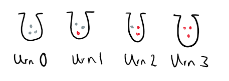
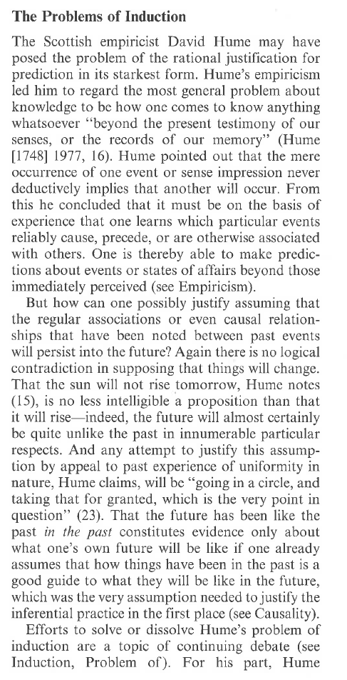
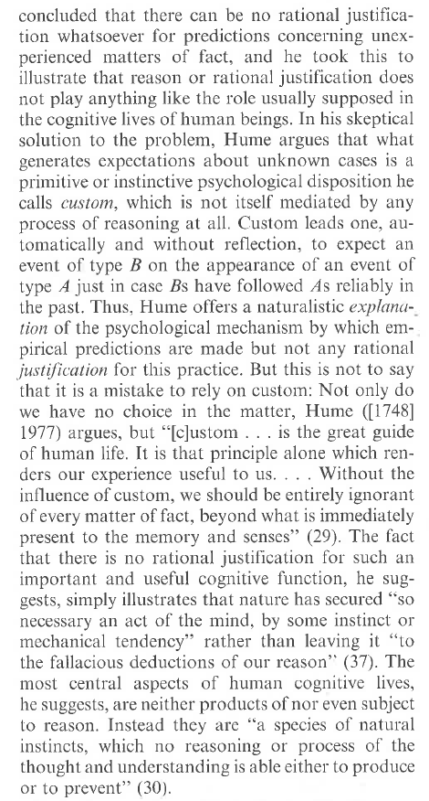

# The Rule of Succession

Suppose that we are flipping a coin. The Rule of Succession states that after observing $m$ heads in $n$ tosses, the probability of heads on toss $n+1$ is:

$$
P_{n+1}(H_{n+1}) = \frac{m+1}{n + 2}
$$

Generally, for two variables $h$ and $t$ which represent our initial beliefs about how likely the coin is to land heads or tails (i.e., $h = P(H)$ and $t = P(T)$), then:
$$
P_{n+1} (H_{n+1}) = \frac{m + h}{n + h + t}
$$
and this generalizes to three kinds of events (e.g., a box filled with three different colored balls) then let $g$ represent our prior beliefs about how likely it is that we are to get the green balls; $r$ for the red balls; and $b$ for the blue balls. Let $R$ be the proposition that we draw a red ball. Then:
$$
P_{n + 1}(R_{n+1}) = \frac{m + r}{n + r + g + b}
$$
Notice that the denominator $n + r + g + b$ is just $n$ (the number of previous draws from the box that we have made) plus the three variables representing the probabilities of drawing green, red, and blue respectively.

# Deriving the Rule of Succession (BONUS: NOT ON QUIZ)

You might be curious as to how we get the Rule of Succession. This is covered here. The treatment here follows the one in William Feller's *An Introduction to Probability Theory and its Applications*.

Suppose we have $N + 1$ urns. Each urn contains $N$ balls [Note: we start counting from $0$]. The balls can be red or white: for the $k$th urn, that urn contains $k$ red balls and $N - k$ white balls. For example, for $N = 3$ we have the following picture:

{width=350px}

We consider the following experiment: we first pick an urn at random and we draw from that urn $d$ times with replacement (i.e., we always put the ball back into the urn). So if we pick urn $k$ then the probability that we get $d$ red balls is $(k/N)^d$ (the $k$ is from the fact that in urn $k$, there are $k$ red balls; the $N$ is from the fact that each urn has $N$ balls; and the $d$ from the fact that we are drawing from that urn $d$ times).

Let $K_0$ be the proposition that we picked urn $0$, $K_1$ the proposition that we picked urn $1$, and so on up to $K_{N}$. Note that in our experiment, we must pick at least one of the urns the collection of propositions $\{K_1,K_2,\ldots,K_N\}$ is exhaustive. That collection also contains propositions which are mutually exclusive from one another. Hence, it forms a partition. Let $A$ be the proposition that all the balls we draw in $d$ draws are red (equivalently, we draw no white balls in $d$ draws). Therefore, by the Theorem of Total Probability:

$$
P(A) = P(A|K_0)P(K_0) + P(A|K_1)P(K_1) + \cdots + P(A|K_{N})P(K_{N})
$$

Now we just showed earlier that $P(A|K_i) = (i/N)^d$ for any $i$. Furthermore, the probability that we pick any $K_i$, that is $P(K_i)$, is just $1/N+1$. Therefore:

$$
P(A) = \left(\frac{0}{N^d} \times \frac{1}{N+1}\right) + \left(\frac{1^d}{N^d} \times \frac{1}{N+1}\right) + \left(\frac{2^d}{N^d} \times \frac{1}{N+1}\right) + \cdots + \left(\frac{N^d}{N^d} \times \frac{1}{N+1}\right) 
$$

which, if we do a little algebra, just becomes:

$$
P(A) = \frac{1^d + 2^d + \cdots + N^d}{N^d(N+1)}
$$
Now let $B$ be the proposition that we draw only reds in $d + 1$ draws. We can follow the exact same math as we did to get $P(A)$ to get:

$$
P(B) = \frac{1^{d+1} + 2^{d+1} + \cdots + N^{n+1}}{N^{d+1}(N+1)}
$$
We can also note that $P(A \& B) = P(B)$. Why? If we draw only reds in $d + 1$ draws from the urn then it is of course also true that we only drew reds in $d$ draws. Now what we want is $P(B|A)$ which by the definition of conditional probability:
$$
P(B|A) = \frac{P(A \& B)}{P(A)} = \frac{P(B)}{P(A)}
$$
(Note: You should be able to follow up until now, what follows is slightly more advanced). Now the numerator of $P(A)$, that is, $1^d + 2^d + \cdots + N^d$ can be approximated by the area between the $x$-axis and the graph of the function $f(x) = x^d$. Hence we can write:
$$
1^d + 2^d + \cdots + N^d \approx \int_{0}^{N} x^d dx
$$
which results in:

$$
P(A) \approx \frac{1}{N^d(N+1)} \times \int_{0}^{N} x^d dx = \frac{N}{N+1} \times \frac{1}{d+1} \approx \frac{1}{d+1}
$$
I've just solved it here, so do not worry about the integral. The important part is just that we are replacing the numerator with another mathematical expression which is an approximation (hence why we move from $=$ to $\approx$). Now we repeat this process for $P(B)$ to get:

$$
P(B) \approx \frac{1}{N^{d+1}(N+1)} \times \int_{0}^{N} x^{d+1} dx = \frac{N}{N+1} \times \frac{1}{(d+1)+1} \approx \frac{1}{d + 2}
$$

Therefore:
$$
P(B|A) = \frac{P(B)}{P(A)} \approx \frac{\frac{1}{d+2}}{\frac{1}{d+1}} = \frac{d+1}{d+2} 
$$

And that is how we get the original rule of succession.

Here is how we interpret it under this presentation. Supposing that every composition of an urn is equally probable, and if $d$ trials give us only red balls, then the probability of a red ball on the next trial is $d+1/d+2$. 

# The Problem of Induction (from Jeffrey Barrett and Kyle Stanford "Prediction")

