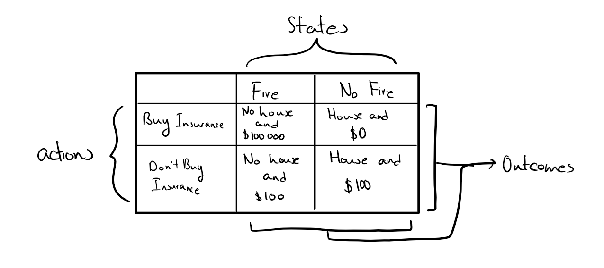
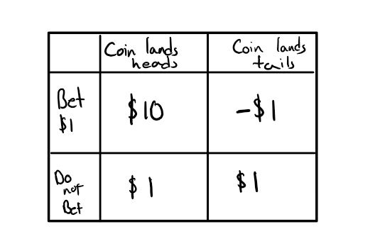

# Decision Theory

Decision theory is the theory of rational decision making. Problems in decision theory are often presented using a decision matrix. Here is an example:

This is a visualization of the decision problem. It is not the decision problem itself! The visualization contains all the information we would need in order to understand a decision problem.

In any case, there are a couple of important components of a decision problem:
- States: These are ways that the world could be. They are not actions, nor are they outcomes of agents taking actions (though we could extend our formalism so that we could consider the states to be other agents and their actions). Often, when characterizing the states we also specify the probabilities of such states.
- Outcomes:  These are what in fact happens *given that we perform an act and the state of the world is a certain way*. In the example above, the outcomes are what happens given that we either buy or do not buy insurance and either there is a fire or there is not. Often, outcomes are given either in terms of money or they are given in terms of utility. We will get to the concept of utility in the next section.
- Acts: In decision theory, we are usually concerned with particular actions which an agent can take. Importantly, the actions which an agent can take must be specified in such a way that the agent can only pick one action amongst the possible actions. For example, the formalism and visualization does not work, if the agent can pick both buy insurance and do not buy insurance.

# Utility

What is utility? Well, one thing is for sure, utility is not monetary value. But just what it is exactly, turns out to be a quite nuanced and complicated question. The word "utility" is also used in a number of different senses in the literature and sometimes it is better to use the term "value" instead. Generally, when we are faced with a decision problem, we have a number of outcomes to consider. For example, in the visualization above, I need to consider the value of my house burning down and me having insurance (and the value of the house burning down and me not having insurance, and the value of the house not burning down and me having insurance, and the value of the house not burning down and me not having insurance). One way of making my reasoning more precise is to assign numbers to these outcomes as a way to formalize this notion of "value" or "utility". 

We can think of utility as a function from action-state pairs to numbers:

$$
U(A\& S) = u_1
$$

This says that, I (or the agent under consideration), assigns utility $u_1$ to the outcome which obtains when $A\& S$ occurs.

Now, again, monetary value is not utility. But often we use money as a proxy for utility. Most individuals value money and it is approximately true that every dollar is valued as much as every other dollar. The reason why monetary value is not to be identified with utility is because it is in fact not true that every dollar is valued as much as every other dollar. An individual with only \$100 in the bank account probably values the next dollar much more than an individual with \$10000000 in their bank account.

# Expected Utility

What we want to know is which act we should perform. To do so, decision theory recommends that we perform the act which maximizes expected utility. What is expected utility? It is the utility that we should expect given that we perform an act. And how do we determine that? We calculated the average utility *weighted by how likely the states are*. Let us consider an example:

{width=350px}

Here we are considering a bet on whether or not a coin comes up heads or tails. You pay \$1 to bet on the coin landing heads. If the coin lands heads then you get your dollar back and an additional \$9. If the coin lands tails then you have lost your \$1 and get nothing in addition. If you do not bet then you keep your dollar in your wallet. So the outcomes here reflect the total amount of money that ends up in your wallet by the end of this whole process. 

This looks like a pretty good bet right? Well, we have actually left out a crucial piece of information: the bias of the coin. Suppose that you believe that the coin is fair. Then what payoff should you expect from betting? 

Half of the time, the coin will come out heads and we get \$10, and the other half of the time, the coin will come out tails and we get -\$1. Suppose we take this bet multiple times (each time starting with only \$1 in our pocket). We keep track of our outcome everytime. At the end we tally up our outcomes and divide by the total number of times we bet. Suppose that we do this bet 100 times. 50 out of 100 times we bet and get heads and win \$10; the other 50 rounds we bet and get tails and lose -\$1. So we end up with:

$$
\frac{(50 \times \$ 10) + (50 \times -\$ 1)}{100} = \frac{\$ 500 - \$50}{100} = \frac{\$450}{100} = \$ 4.5
$$
So the average amount of money we get from betting is \$ 4.5. This is an artificially generated sample. In reality, even if the coin is fair, we will rarely get exactly 50 heads and 50 tails. To calculate the expected utility, what we do is pretend that this is what happens; that the outcomes that we get exactly match the probabilities assigned to the states: 

$$
\begin{align}
EU(bet) &= P(Heads)U(Bet \& Heads) + P(Tails)U(Bet \& Tails)\\
        &= (0.5)(\$ 10) + (0.5)(-\$ 1)\\
        &= \$ 4.5
\end{align}
$$

So here we get the same answer. Now if we want to calculate the expected utility of not betting we get:

$$
EU(\neg bet) = (0.5)(\$ 1) + (0.5)(\$ 1) = \$1
$$
which gives intuitively the right answer. We should expect to keep our \$1 if we do not bet any money. Here we see that the expected utility of betting is greater than the expected utility of not betting. Hence, decision theory recommends that we should take this bet.

Now, what if we do not think that the coin is fair? What if we think that the coin is biased towards tails really heavily. Suppose that $P(Heads) = 0.01$ and $P(Tails) = 0.99$. Then the expected utility will change:

$$
\begin{align}
&EU(bet) = (0.01)(\$10) + (0.99)(-\$1) = \$0.1 - \$0.99 = -\$0.89\\
&EU(\neg bet) = (0.01)(\$1) + (0.99)(\$1) = \$1
\end{align}
$$
Here we see that $EU(bet) < EU(\neg bet)$. Therefore, decision theory recommends that we do not bet. 

The official formula for expected utility is:

$$
EU(A) = \sum_{i=1}^{n} P(S_i) U(A\&S_i)
$$
which says to sum from $i = 1$ to $n$, the product of $P(S_i)$ and $U(A \& S_i)$. In the example we just considered, the utility is just the monetary value. However, again, utility is generally not to be identified with money.

# Fair Bets and Odds

We have a fair bet when the expected utility of betting is equal to the expected utility of not betting:

$$
EU(bet) = EU(\neg bet)
$$

This mean that on average, you come out the same regardless of whether or not you bet or not.

Odds are of the form $x : y$ for the odds of $A$. To obtain the probability from odds, we follow the following formula:
$$
P(A) = \frac{x}{x + y}
$$
Generally, when a bookie (or anyone really) bets you on odds $x : y$, what they are communicating is that they think it is a fair bet, *for them*, to put up $\$ y$ for every $\$ x$ that you put up in the bet. For example, if someone posts odds of $1 : 5$ for some event $A$ occurring, this means that they are willing to bet against you $\$ 5$ for every $\$ 1$ you put up. Let us see how this is a fair bet (in their eyes). According to them, they believe that the expected utility of betting is:

$$
\begin{align}
EU(bet) &= P(A)U(bet \& A) + P(\neg A)U(bet \& \neg A)\\
&= \frac{5}{6} \$ 1 + \frac{1}{6} -\$ 5 \\
&= \$ \frac{5}{6} - \$ \frac{5}{6}\\
&= 0
\end{align}
$$
And we have the expected utility of not betting is just $\$ 0$. Hence, from their perspective, it is a fair bet.

It is crucial to recognize that you yourself may assign different probabilities to the event $A$. If you think that $A$ has probability $\frac{1}{6}$ and that $\neg A$ has probability $\frac{5}{6}$ then from your perspective, the bet is not fair, its advantageous to you!

$$
\begin{align}
EU(bet) &= P(A)U(bet \& A) + P(\neg A)U(bet \& \neg A)\\ 
&= \frac{1}{6} -\$ 1 + \frac{5}{6} \$ 5\\
&= - \$ \frac{1}{6} + \$ \frac{25}{6}\\
&= \$ 4
\end{align}
$$
and again, the expected utility of not betting is $\$0$. 

